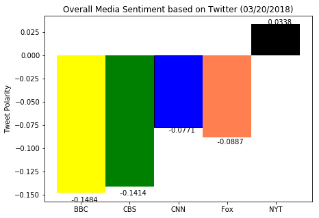

```python
# Unit 7 Assignment - Distinguishing Sentiments

# Background
#  Twitter has become a wildly sprawling jungle of information—140 characters at a time.
#  Somewhere between 350 million and 500 million tweets are estimated to be sent out per day. 
#  With such an explosion of data, on Twitter and elsewhere, it becomes more important than ever to tame it in some way, to concisely capture the essence of the data.

#News Mood
#  In this assignment, you'll create a Python script to perform a sentiment analysis of the Twitter activity of various news oulets, and to present your findings visually.
#  Your final output should provide a visualized summary of the sentiments expressed in Tweets sent out by the following news organizations: BBC, CBS, CNN, Fox, and New York times.

# The tools of the trade you will need for your task as a data analyst include the following: tweepy, pandas, matplotlib, seaborn, textblob, and VADER.
# Your final Jupyter notebook must:
  # Pull last 100 tweets from each outlet.
  # Perform a sentiment analysis with the compound, positive, neutral, and negative scoring for each tweet.
  # Pull into a DataFrame the tweet's source acount, its text, its date, and its compound, positive, neutral, and negative sentiment scores.
  # Export the data in the DataFrame into a CSV file.
  # Save PNG images for each plot.
# As final considerations:
  # Use the Matplotlib and Seaborn libraries.
  # Include a written description of three observable trends based on the data.
  # Include proper labeling of your plots, including plot titles (with date of analysis) and axes labels.
  # Include an exported markdown version of your Notebook called README.md in your GitHub repository.

```


```python
# Dependencies
import datetime as dt
import tweepy
import json
import numpy as np
import pandas as pd
import matplotlib.pyplot as plt
%matplotlib inline
#from TwitterAPITweepy.py import api_key

# Import and Initialize Sentiment Analyzer
from vaderSentiment.vaderSentiment import SentimentIntensityAnalyzer
analyzer = SentimentIntensityAnalyzer()

# Twitter API Keys
consumer_key = ""
consumer_secret = ""
access_token = ""
access_token_secret = ""

# Setup Tweepy API Authentication
auth = tweepy.OAuthHandler(consumer_key, consumer_secret)
auth.set_access_token(access_token, access_token_secret)
#api = tweepy.API(auth, parser=tweepy.parsers.JSONParser())
api = tweepy.API(auth)

```


```python
#  Pull Twitter data
PageLoops = 100
# Target User Accounts
target_user = ('@CNN', '@BBCNews', '@CBSNews', '@FoxNews', '@nytimes')

# lists for holding sentiments
user_list = []
compound_list = []
positive_list = []
negative_list = []
neutral_list = []
tweets_ago = []


# Loop through each user
for user in target_user:

    current_user = user
    tweet_counter = 0
    print(current_user)
    # Loop through PageLoops pages of tweets (total 500 tweets)
    for page in tweepy.Cursor(api.user_timeline, id=user).pages(PageLoops):

        # Get all tweets from home feed
        #public_tweets = api.user_timeline(user)
        page = page[0]
        tweet = json.dumps(page._json, indent=3)
        tweet = json.loads(tweet)
        text = tweet['text']

        # Run Vader Analysis on each tweet
        compound = analyzer.polarity_scores(text)["compound"]
        pos = analyzer.polarity_scores(text)["pos"]
        neu = analyzer.polarity_scores(text)["neu"]
        neg = analyzer.polarity_scores(text)["neg"]

        # Add each value to the appropriate array
        user_list.append(current_user) 
        compound_list.append(compound)
        positive_list.append(pos)
        negative_list.append(neg)
        neutral_list.append(neu)
        tweets_ago.append(tweet_counter)
        tweet_counter = tweet_counter + 1

```

    @CNN
    @BBCNews
    @CBSNews
    @FoxNews
    @nytimes
    


```python
# create a data frame for the target, compound, pos, neu, and negative scores
Tweet_dict = {'News Source': user_list,
              'Compound Score': compound_list,
              'Positive Score': positive_list,
              'Neutral Score': neutral_list,
              'Negative Score': negative_list,
              'Tweets Ago': tweets_ago
              }

# Create a dataframe for the results
TweetResults_df = pd.DataFrame(Tweet_dict)
TweetResults_df.head(11)
# Write the dataframe to a .csv
file_name = 'TweetResults.csv'
TweetResults_df.to_csv(file_name, encoding='utf-8', index=False)

```


```python
#The first plot will be and/or feature the following:
  # Be a scatter plot of sentiments of the last 100 tweets sent out by each news organization, ranging from -1.0 to 1.0, where a score of 0 expresses a neutral sentiment, -1 the most negative sentiment possible, and +1 the most positive sentiment possible.
  # Each plot point will reflect the compound sentiment of a tweet.
  # Sort each plot point by its relative timestamp.

# Time for a chart!
CNN_Tweets_df = TweetResults_df.loc[TweetResults_df['News Source'] == '@CNN',:]
BBC_Tweets_df = TweetResults_df.loc[TweetResults_df['News Source'] == '@BBCNews',:]
CBS_Tweets_df = TweetResults_df.loc[TweetResults_df['News Source'] == '@CBSNews',:]
Fox_Tweets_df = TweetResults_df.loc[TweetResults_df['News Source'] == '@FoxNews',:]
NYTimes_Tweets_df = TweetResults_df.loc[TweetResults_df['News Source'] == '@nytimes',:]

CNN_Tweets_df.head()
```


<div>
<style>
    .dataframe thead tr:only-child th {
        text-align: right;
    }

    .dataframe thead th {
        text-align: left;
    }

    .dataframe tbody tr th {
        vertical-align: top;
    }
</style>
<table border="1" class="dataframe">
  <thead>
    <tr style="text-align: right;">
      <th></th>
      <th>Compound Score</th>
      <th>Negative Score</th>
      <th>Neutral Score</th>
      <th>News Source</th>
      <th>Positive Score</th>
      <th>Tweets Ago</th>
    </tr>
  </thead>
  <tbody>
    <tr>
      <th>0</th>
      <td>-0.4404</td>
      <td>0.153</td>
      <td>0.847</td>
      <td>@CNN</td>
      <td>0.000</td>
      <td>0</td>
    </tr>
    <tr>
      <th>1</th>
      <td>-0.7184</td>
      <td>0.240</td>
      <td>0.760</td>
      <td>@CNN</td>
      <td>0.000</td>
      <td>1</td>
    </tr>
    <tr>
      <th>2</th>
      <td>0.5267</td>
      <td>0.000</td>
      <td>0.848</td>
      <td>@CNN</td>
      <td>0.152</td>
      <td>2</td>
    </tr>
    <tr>
      <th>3</th>
      <td>-0.4939</td>
      <td>0.198</td>
      <td>0.802</td>
      <td>@CNN</td>
      <td>0.000</td>
      <td>3</td>
    </tr>
    <tr>
      <th>4</th>
      <td>0.1779</td>
      <td>0.000</td>
      <td>0.876</td>
      <td>@CNN</td>
      <td>0.124</td>
      <td>4</td>
    </tr>
  </tbody>
</table>
</div>


```python
# set the date
currentdate = dt.datetime.today().strftime("%m/%d/%Y")
print(currentdate)
```

    03/20/2018
    


```python
# Scatter Plot: Sentiment Analysis of CNN Tweets
y_axis = CNN_Tweets_df['Compound Score']
x_axis = CNN_Tweets_df['Tweets Ago']
CNNAnalysis = plt.scatter(x_axis, y_axis, marker="o", facecolors= 'blue', edgecolors='black',
            s=40, alpha=0.40)

# Scatter Plot: Sentiment Analysis of MSNBC Tweets
y_axis = BBC_Tweets_df['Compound Score']
x_axis = BBC_Tweets_df['Tweets Ago']
BBCAnalysis = plt.scatter(x_axis, y_axis, marker="o", facecolors= 'yellow', edgecolors='black',
            s=40, alpha=0.40)

# Scatter Plot: Sentiment Analysis of Daily Mail Tweets
y_axis = CBS_Tweets_df['Compound Score']
x_axis = CBS_Tweets_df['Tweets Ago']
CBSAnalysis = plt.scatter(x_axis, y_axis, marker="o", facecolors= 'green', edgecolors='black',
            s=40, alpha=0.40)

# Scatter Plot: Sentiment Analysis of Chicago Tribune Tweets
y_axis = Fox_Tweets_df['Compound Score']
x_axis = Fox_Tweets_df['Tweets Ago']
FoxAnalysis = plt.scatter(x_axis, y_axis, marker="o", facecolors= 'coral', edgecolors='black',
            s=40, alpha=0.40)

# Scatter Plot: Sentiment Analysis of New York Times Tweets
y_axis = NYTimes_Tweets_df['Compound Score']
x_axis = NYTimes_Tweets_df['Tweets Ago']
NYTimesAnalysis = plt.scatter(x_axis, y_axis, marker="o", facecolors= 'black', edgecolors='black',
            s=40, alpha=0.40)

plt.xlim(105, -5)
plt.ylim(-1, 1)
plt.title('Sentiment Analysis of Media Tweets (' + currentdate + ')')
plt.xlabel('Tweets Ago')
plt.ylabel('Tweet Polarity')
plt.legend([CNNAnalysis,
            BBCAnalysis,
            CBSAnalysis,
            FoxAnalysis,
            NYTimesAnalysis],
            ['CNN', 'BBC', 'CBS', 'Fox', 'NY Times'],
            loc = 9, bbox_to_anchor=(1.2,0.95), title = 'Media Sources')
plt.savefig('SentimentAnalysis.png')

```


```python
# The second plot will be a bar plot visualizing the overall sentiments of the last 100 tweets from
# each organization. For this plot, you will again aggregate the compound sentiments analyzed by VADER.

# Get the summarized Compound Score
CNN_Avg_CompoundScore = (TweetResults_df.loc[TweetResults_df['News Source'] == '@CNN', 'Compound Score'].sum() / PageLoops)
BBC_Avg_CompoundScore = (TweetResults_df.loc[TweetResults_df['News Source'] == '@BBCNews', 'Compound Score'].sum() / PageLoops)
CBS_Avg_CompoundScore = (TweetResults_df.loc[TweetResults_df['News Source'] == '@CBSNews', 'Compound Score'].sum() / PageLoops)
Fox_Avg_CompoundScore = (TweetResults_df.loc[TweetResults_df['News Source'] == '@FoxNews', 'Compound Score'].sum() / PageLoops)
NYTimes_Avg_CompoundScore = (TweetResults_df.loc[TweetResults_df['News Source'] == '@nytimes', 'Compound Score'].sum() / PageLoops)

#Build a dataframe for the results
OverallMediaSentiment_df = pd.DataFrame({'News Source': ['CNN', 'BBC','CBS', 'Fox', 'NYT'],
                                         'Avg Compound Score': [CNN_Avg_CompoundScore,
                                         BBC_Avg_CompoundScore, CBS_Avg_CompoundScore,
                                         Fox_Avg_CompoundScore, NYTimes_Avg_CompoundScore],
                                         'Color':['blue', 'yellow', 'green', 'coral', 'black']
                                        })
OverallMediaSentiment_df.head()
```


<div>
<style>
    .dataframe thead tr:only-child th {
        text-align: right;
    }

    .dataframe thead th {
        text-align: left;
    }

    .dataframe tbody tr th {
        vertical-align: top;
    }
</style>
<table border="1" class="dataframe">
  <thead>
    <tr style="text-align: right;">
      <th></th>
      <th>Avg Compound Score</th>
      <th>Color</th>
      <th>News Source</th>
    </tr>
  </thead>
  <tbody>
    <tr>
      <th>0</th>
      <td>-0.077059</td>
      <td>blue</td>
      <td>CNN</td>
    </tr>
    <tr>
      <th>1</th>
      <td>-0.148401</td>
      <td>yellow</td>
      <td>BBC</td>
    </tr>
    <tr>
      <th>2</th>
      <td>-0.141422</td>
      <td>green</td>
      <td>CBS</td>
    </tr>
    <tr>
      <th>3</th>
      <td>-0.088686</td>
      <td>coral</td>
      <td>Fox</td>
    </tr>
    <tr>
      <th>4</th>
      <td>0.033761</td>
      <td>black</td>
      <td>NYT</td>
    </tr>
  </tbody>
</table>
</div>


```python
# New Bar Chart
width = 1  # the width of the bars
fig = plt.figure(figsize = (7,5))
ax = fig.add_subplot(1,1,1)
rects1 = ax.bar(OverallMediaSentiment_df['News Source'], OverallMediaSentiment_df['Avg Compound Score'],
                width, color=OverallMediaSentiment_df['Color'], edgecolor = 'black')

# Add some text for labels, title and custom x-axis tick labels, etc.
ax.set_ylabel('Tweet Polarity')
ax.set_title('Overall Media Sentiment based on Twitter (' + currentdate + ')')
ax.legend()

def autolabel(rects):
    #"""
    #Attach a text label above each bar displaying its height
    #"""
    for rect in rects:
        height = rect.get_height()
        ax.text(rect.get_x() + rect.get_width()/2., 1.05*height,
                "{:10.4f}".format(height),
                ha='center', va='center')

autolabel(rects1)
print(rects1[0])
#
plt.show()
```

    Rectangle(xy=(1.5, 0), width=1, height=-0.077059, angle=0)
    





```python

def autolabel(rects, xpos='center'):
    """
    Attach a text label above each bar in *rects*, displaying its height.

    *xpos* indicates which side to place the text w.r.t. the center of
    the bar. It can be one of the following {'center', 'right', 'left'}.
    """

    xpos = xpos.lower()  # normalize the case of the parameter
    ha = {'center': 'center', 'right': 'left', 'left': 'right'}
    offset = {'center': 0.5, 'right': 0.57, 'left': 0.43}  # x_txt = x + w*off

    for rect in rects:
        height = rect.get_height()
        ax.text(rect.get_x() + rect.get_width()*offset[xpos], 1.01*height,
                '{}'.format(height), ha=ha[xpos], va='bottom')


autolabel(rects1, "left")
autolabel(rects2, "right")


plt.show()
```


```python
# Bar chart
Bar_y_axis = OverallMediaSentiment_df['Avg Compound Score']
Bar_x_axis = OverallMediaSentiment_df['News Source']

# Tell matplotlib that we will be making a bar chart
# Users is our y axis and x_axis is, of course, our x axis
# We apply align="edge" to ensure our bars line up with our tick marks
plt.bar(Bar_x_axis, Bar_y_axis, color=OverallMediaSentiment_df['Color'], alpha=0.5, align="center")

plt.ylim(-0.23, 0.20)
plt.title('Overall Media Sentiment based on Twitter (' + currentdate + ')')
plt.ylabel('Tweet Polarity')


plt.savefig('OverallMediaSentiment.png')

```


